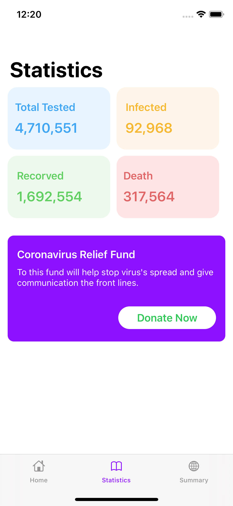

# covid19-swiftui
Beautiful covid information app build in SwiftUI with networking

<h2>Screenshots</h2>
<h4>Homepage</h4>

<h4>World Statistics</h4>

<h4>Country list statistics</h4>

<h4>Country detail statistics</h4>

<h2>Features</h2>
<ul>
    <li>Https request(networking)</li>
    <li>Using global environment</li>
    <li>Linear gradient</li>
</ul>

<h2>Credits</h2>
<h4>Design Credit<h4>

https://dribbble.com/shots/11103623-COVID-19-Virus-Tracker-Donation-Application

<h4>API</h4>

https://covid19api.com/

<h4>Flag Icons</h4>

https://www.countryflags.com/en/

